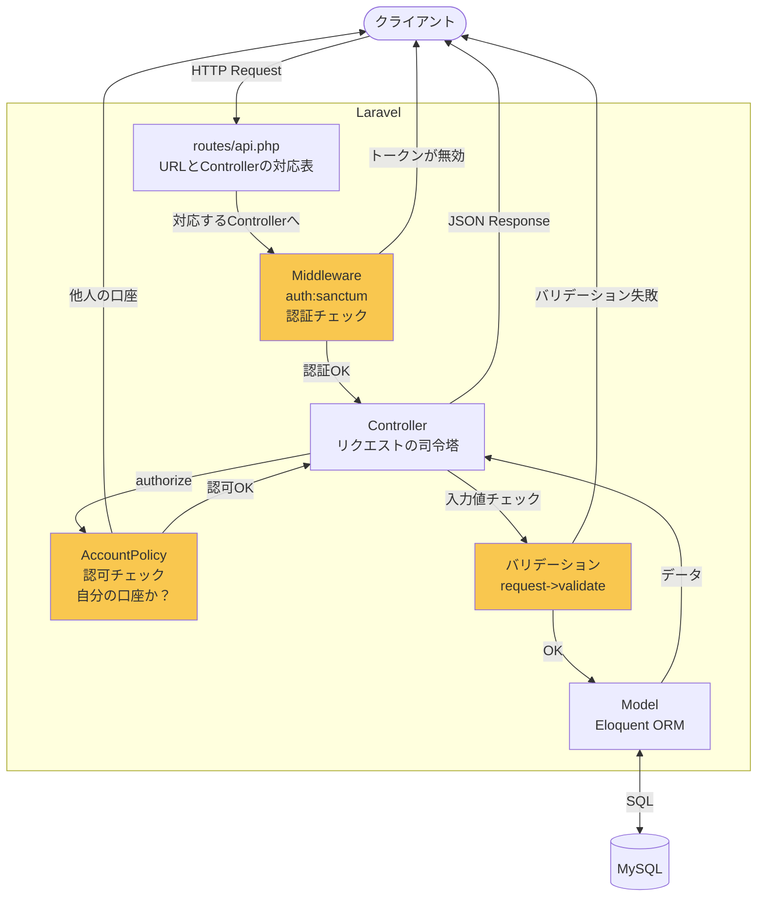
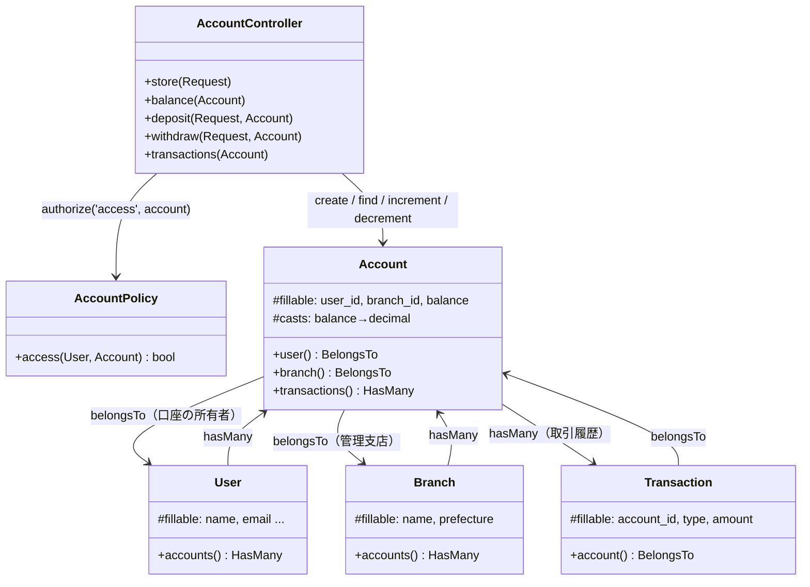
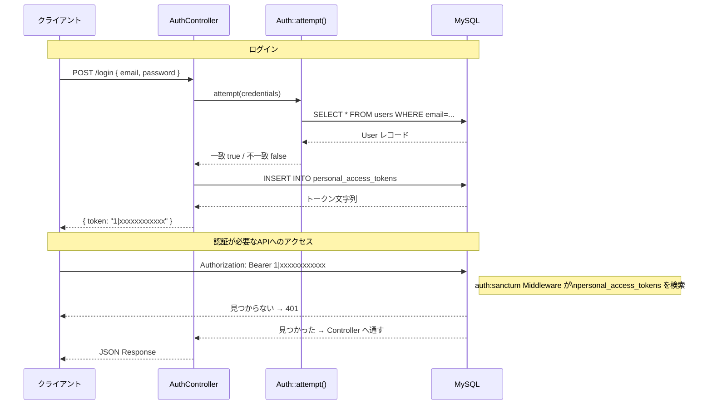
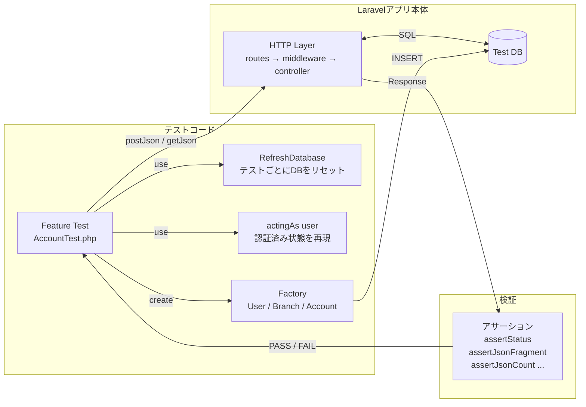
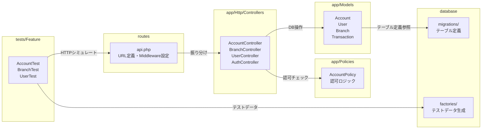

# Laravel アーキテクチャ全体図

---

## 1. リクエストが届いてからレスポンスが返るまで

黄色はリクエストが「弾かれる可能性のある関所」。

| 関所 | 弾かれたときのステータス | 担当 |
|------|------|------|
| Middleware | 401 Unauthorized | Sanctum |
| Policy | 403 Forbidden | AccountPolicy |
| バリデーション | 422 Unprocessable | Controller内の validate() |

---

## 2. クラスの依存関係

---

## 3. 認証（ログイン〜APIアクセス）の流れ

---

## 4. テストの構造

---

## 5. ファイル構成と役割の対応

---

## 6. 一言まとめ

| コンポーネント | 一言で言うと |
|---|---|
| `routes/api.php` | URL と Controller の対応表。Middleware もここで設定 |
| Middleware (`auth:sanctum`) | Controller の手前にある「認証の関所」 |
| Controller | リクエストを受け取り、Policy・Model・レスポンスを調整する司令塔 |
| Policy | 「誰が何をしていいか」のルールブック |
| Model | DB のテーブルを PHP オブジェクトとして扱う窓口。リレーションも定義 |
| Migration | テーブルの設計図（PHP で書いた CREATE TABLE） |
| Factory | テスト用ダミーデータの生成器 |
| Feature Test | HTTP リクエストをシミュレートして API の動作を検証する |
| `RefreshDatabase` | テストごとに DB をリセットするトレイト |
| `actingAs()` | テスト内で「このユーザーでログイン済み」状態を作るメソッド |
