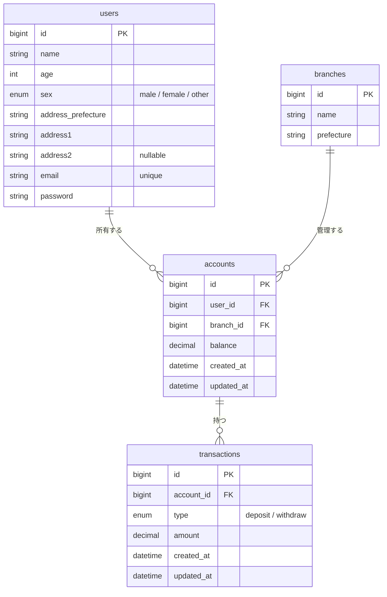

# 預金額管理 API — 設計ドキュメント

## プロジェクト概要

口座の開設・残高照会・入出金・取引履歴の取得ができるシンプルな REST API。
ユーザー・支店・口座・取引履歴の 4 リソースを管理する。

認証機能は持つが、ログイン機能は未実装（将来の拡張を想定してカラムのみ定義）。

## 技術スタック

| 用途 | 技術 |
|------|------|
| フレームワーク | Laravel 13 |
| DB | MySQL 8.4 |
| 実行環境 | Docker (Laravel Sail) |

## API エンドポイント

| メソッド | パス | 説明 |
|----------|------|------|
| POST | `/api/accounts` | 口座作成 |
| GET | `/api/accounts/{id}/balance` | 残高照会 |
| POST | `/api/accounts/{id}/deposit` | 入金 |
| POST | `/api/accounts/{id}/withdraw` | 出金 |
| GET | `/api/accounts/{id}/transactions` | 取引履歴取得 |

## ER 図

## テーブル定義

### users

| カラム名 | 型 | 制約 | 説明 |
|---|---|---|---|
| id | bigint | PK / AUTO INCREMENT | |
| name | varchar | NOT NULL | 氏名 |
| age | int | NOT NULL | 年齢 |
| sex | enum | NOT NULL | `male` / `female` / `other` |
| address_prefecture | varchar | NOT NULL | 都道府県 |
| address1 | varchar | NOT NULL | 市区町村・番地 |
| address2 | varchar | nullable | 建物名・部屋番号 |
| email | varchar | NOT NULL / UNIQUE | メールアドレス |
| password | varchar | NOT NULL | パスワード（ハッシュ） |

### branches

| カラム名 | 型 | 制約 | 説明 |
|---|---|---|---|
| id | bigint | PK / AUTO INCREMENT | |
| name | varchar | NOT NULL | 支店名 |
| prefecture | varchar | NOT NULL | 都道府県 |

### accounts

| カラム名 | 型 | 制約 | 説明 |
|---|---|---|---|
| id | bigint | PK / AUTO INCREMENT | |
| user_id | bigint | FK → users.id | 口座保有者 |
| branch_id | bigint | FK → branches.id | 管理支店 |
| balance | decimal(15,2) | NOT NULL / DEFAULT 0 | 残高 |
| created_at | datetime | | |
| updated_at | datetime | | |

### transactions

| カラム名 | 型 | 制約 | 説明 |
|---|---|---|---|
| id | bigint | PK / AUTO INCREMENT | |
| account_id | bigint | FK → accounts.id | 対象口座 |
| type | enum | NOT NULL | `deposit`（入金）/ `withdraw`（出金） |
| amount | decimal(15,2) | NOT NULL | 金額 |
| created_at | datetime | | |
| updated_at | datetime | | |
